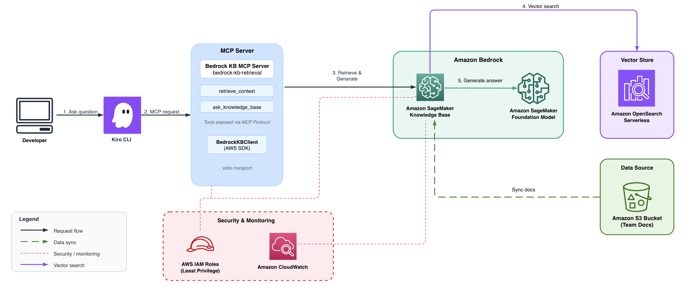
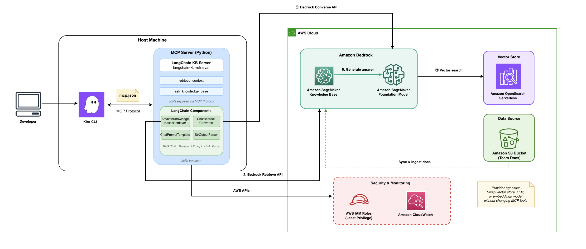

# Context-Aware AI with Bedrock MCP Server and Kiro

Build context-aware development assistants that let developers query organizational knowledge — ADRs, API specs, security guidelines, coding standards — directly from Kiro IDE or Kiro CLI, without leaving their editor.

Uses the official [awslabs.bedrock-kb-retrieval-mcp-server](https://awslabs.github.io/mcp/servers/bedrock-kb-retrieval-mcp-server) for Kiro integration, plus a [LangChain](https://www.langchain.com/) alternative demonstrating how to swap orchestration layers with minimal code changes.

## Architecture

### Bedrock KB MCP Server



A developer asks a question in Kiro. Kiro spawns the official [Amazon Bedrock](https://aws.amazon.com/bedrock/) Knowledge Base MCP server via `uvx`. The server discovers Knowledge Bases tagged with `mcp-multirag-kb=true`, queries them using the Retrieve API, and returns relevant passages with citations. Under the hood, [Amazon Bedrock Knowledge Bases](https://aws.amazon.com/bedrock/knowledge-bases/) embeds the query with Amazon Titan Text Embeddings v2, searches [Amazon OpenSearch Serverless](https://aws.amazon.com/opensearch-service/features/serverless/) for matching chunks, and returns ranked results.

### LangChain Alternative



The LangChain server replaces the official MCP server with a custom Python implementation. It uses LangChain's LCEL chain (`AmazonKnowledgeBasesRetriever → ChatPromptTemplate → ChatBedrock Converse → StrOutputParser`) to orchestrate retrieval and answer generation. The key advantage is provider portability — swap the vector store, LLM, or embeddings model without changing the MCP tools exposed to Kiro.

## Project Structure

```
├── .kiro/settings/mcp.json              # Kiro MCP config (both servers)
├── kiro-bedrock-kb-mcp/
│   ├── infrastructure/                  # AWS CDK stack (VPC, S3, OpenSearch, Bedrock KB, IAM, CloudWatch)
│   │   ├── bin/app.ts                   # CDK app entry point
│   │   └── lib/
│   │       ├── bedrock-kb-stack.ts      # Core infrastructure
│   │       └── monitoring-stack.ts      # CloudWatch dashboard and alarms
│   ├── langchain-alternative/           # Custom MCP server — Python (LangChain)
│   │   ├── mcp_server.py               # MCP tools with LangChain orchestration
│   │   ├── kb_retriever.py             # LCEL chain: Retriever → Prompt → LLM → Parse
│   │   ├── metrics.py                  # CloudWatch metrics emitter
│   │   └── run_server.sh              # Wrapper script (resolves venv paths dynamically)
│   ├── sample-knowledge-base/           # Example team docs (uploaded to S3)
│   ├── scripts/                         # Automated setup and sync scripts
│   ├── TESTING-GUIDE.md                 # Detailed testing guide for both servers
│   └── COMPARISON.md                    # Official vs LangChain server comparison
└── README.md                            # This file
```

## What Gets Created in Your AWS Account

| Resource | Purpose |
|----------|---------|
| VPC + private subnets | Network isolation for OpenSearch |
| OpenSearch Serverless collection | Vector store for document embeddings |
| S3 bucket | Stores your knowledge base documents |
| Bedrock Knowledge Base | Orchestrates embedding + retrieval |
| IAM roles | Least-privilege access for all services |
| CloudWatch dashboard | Monitoring (latency, errors, query volume) |

---

## Complete Setup Guide

### Phase 1: Install Prerequisites

```bash
# Node.js 18+ (required for CDK)
brew install node

# AWS CLI v2
brew install awscli

# AWS CDK
npm install -g aws-cdk

# uv/uvx (runs the official MCP server)
brew install uv

# jq (JSON processor, used by scripts)
brew install jq

# Python 3.11+ (required for LangChain alternative)
brew install python@3.11

# Kiro IDE — download from https://kiro.dev/downloads/
```

Verify everything:

```bash
node -v          # Should be 18+
aws --version    # Should be v2
cdk --version    # Should be 2.x
uvx --version    # Should print version
jq --version     # Should print version
python3 --version # Should be 3.11+
```

### Phase 2: Clone the Repository

```bash
git clone <repo_url>
```


### Phase 3: Configure AWS Credentials

Create an IAM user in the [AWS Console](https://console.aws.amazon.com/iam/) with these managed policies:

- `AmazonBedrockFullAccess`
- `AmazonS3FullAccess`
- `AmazonOpenSearchServiceFullAccess`
- `CloudWatchFullAccess`
- `IAMFullAccess`
- `AWSCloudFormationFullAccess`
- `AmazonVPCFullAccess`
- `AWSLambda_FullAccess`

Create access keys for CLI access, then configure:

```bash
aws configure
# Enter: Access Key ID, Secret Access Key, Region: us-east-1, Output: json

# Verify
aws sts get-caller-identity
```

### Phase 4: Enable Bedrock Model Access (AWS Console — one-time)

1. Go to [Amazon Bedrock Console](https://console.aws.amazon.com/bedrock/) → **Model access**
2. Request access to:
   - **Amazon Titan Text Embeddings v2** (required — used for document embedding)
   - **Anthropic Claude 3.5 Haiku** (required for LangChain alternative)
3. Wait until status shows "Access granted"

### Phase 5: Deploy Infrastructure

```bash
cd kiro-bedrock-kb-mcp
chmod +x scripts/setup.sh
./scripts/setup.sh
```

This takes ~10–15 minutes. It will:

1. Install CDK dependencies
2. Bundle the Lambda for OpenSearch index creation
3. Bootstrap CDK in your account/region
4. Deploy VPC, OpenSearch Serverless, S3, Bedrock Knowledge Base, IAM roles, CloudWatch dashboard
5. Upload sample documents to S3
6. Trigger document ingestion (~2–3 minutes)

> **Note:** The script may hang at "Verifying MCP server availability" — press **Ctrl+C** to skip. That step is just a verification and doesn't affect the deployment.

Save the output — you'll need the **Knowledge Base ID** from the deployment outputs.

### Phase 6: Verify Document Ingestion

```bash
KB_ID=$(jq -r '.KiroBedrockKBStack.KnowledgeBaseId' cdk-outputs.json)
DS_ID=$(jq -r '.KiroBedrockKBStack.DataSourceId' cdk-outputs.json)

aws bedrock-agent list-ingestion-jobs \
  --knowledge-base-id "$KB_ID" \
  --data-source-id "$DS_ID" \
  --region us-east-1 \
  --query 'ingestionJobSummaries[0].status' \
  --output text
```

Should return `COMPLETE`. If it says `IN_PROGRESS`, wait a minute and try again.

### Phase 7: Test the Official MCP Server in Kiro

The `.kiro/settings/mcp.json` is pre-configured for the official server — no changes needed.

1. Open the project folder in **Kiro**
2. Restart Kiro (Cmd+Q on macOS, then relaunch) to pick up the MCP config
3. Ask in Kiro chat:
   - *"What's our circuit breaker pattern?"*
   - *"What authentication does the Orders API require?"*
   - *"What are our coding standards for error handling?"*

The official server connects automatically and returns results from your Knowledge Base.

### Phase 8: Set Up the LangChain Alternative (Optional)

The LangChain server adds RAG capabilities — synthesized answers with citations, confidence filtering, and provider portability.

```bash
# 1. Create Python venv and install dependencies
cd kiro-bedrock-kb-mcp/langchain-alternative
python3 -m venv .venv
source .venv/bin/activate
pip install -r requirements.txt

# 2. Make the wrapper script executable
chmod +x run_server.sh

# 3. Get your Knowledge Base ID
cd ..
KB_ID=$(jq -r '.KiroBedrockKBStack.KnowledgeBaseId' cdk-outputs.json)
echo "Your Knowledge Base ID: $KB_ID"
```

### Phase 9: Update MCP Config with Your Knowledge Base ID

Edit `.kiro/settings/mcp.json` and replace the placeholder in the `bedrock-kb-langchain` section:

```
"KNOWLEDGE_BASE_ID": "<YOUR_KNOWLEDGE_BASE_ID>"
```

Change `<YOUR_KNOWLEDGE_BASE_ID>` to the KB ID from the previous step.

### Phase 10: Test Both MCP Servers

1. Restart Kiro (Cmd+Q, relaunch)
2. Check MCP logs to confirm both servers show "Successfully connected"
3. Test with these prompts:

| Prompt | What it tests |
|--------|--------------|
| *"What's our circuit breaker pattern?"* | Official server — raw document retrieval |
| *"List the types of documents in our knowledge base"* | LangChain — `list_knowledge_sources` |
| *"How should I implement error handling in our TypeScript services?"* | LangChain — `ask_knowledge_base` (RAG) |
| *"Query both MCP servers about our deployment rollback procedure"* | Both servers side by side |

See [TESTING-GUIDE.md](kiro-bedrock-kb-mcp/TESTING-GUIDE.md) for the full testing guide and [COMPARISON.md](kiro-bedrock-kb-mcp/COMPARISON.md) for a detailed comparison of both servers.

---

## Adding Your Own Documents

1. Add markdown, text, or PDF files to `kiro-bedrock-kb-mcp/sample-knowledge-base/`
2. Sync and re-ingest:

```bash
cd kiro-bedrock-kb-mcp
chmod +x scripts/sync-knowledge-base.sh
./scripts/sync-knowledge-base.sh
```

## Kiro CLI Usage

The `.kiro/settings/mcp.json` config works for both the Kiro IDE and Kiro CLI — no separate configuration needed.

```bash
# Interactive session
kiro-cli chat

# Headless query (requires KIRO_API_KEY — Kiro Pro/Pro+/Power subscription)
export KIRO_API_KEY="your-api-key"
kiro-cli chat --no-interactive --trust-tools=read \
  "What's our circuit breaker pattern?"
```

## Monitoring

The CDK stack deploys a CloudWatch dashboard named **Kiro-BedrockKB-Integration** with:

- Query volume and P99 retrieval latency
- Error count and empty result rate
- Alarm status (latency > 5s, errors > 10/5min)

Access it from the CDK output `DashboardURL`, or find it in the [Amazon CloudWatch console](https://console.aws.amazon.com/cloudwatch/).

## Cleanup

```bash
cd kiro-bedrock-kb-mcp/infrastructure
npx cdk destroy --all
```

This removes all AWS resources including the VPC, OpenSearch collection, S3 buckets, Knowledge Base, IAM roles, and CloudWatch dashboard.

> **Important:** OpenSearch Serverless costs ~$20–30/day while running. Don't forget to clean up when done.

## Troubleshooting

| Problem | Fix |
|---------|-----|
| `ENOENT` error for LangChain server | Run Phase 8 — create the `.venv` and `chmod +x run_server.sh` |
| `security token invalid` | Refresh AWS credentials with `aws configure` and restart Kiro |
| `ResourceNotFoundException: model marked as Legacy` | Update `MODEL_ID` in `mcp.json` to a current inference profile |
| Official server doesn't find any KBs | Verify the KB has the tag `mcp-multirag-kb=true` in the Bedrock console |
| Ingestion stuck on `IN_PROGRESS` | Wait 5 minutes. If still stuck, check the Bedrock console for errors |
| Setup script hangs at "Verifying MCP server" | Press Ctrl+C — it's just a verification step |
| `No relevant documents found` | Run `./scripts/sync-knowledge-base.sh` to re-ingest documents |

## Contributing

See [CONTRIBUTING.md](CONTRIBUTING.md) for guidelines on reporting bugs, suggesting features, and submitting pull requests.

## License

MIT-0
