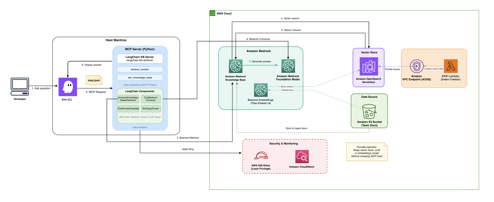

# LangChain Alternative — Custom MCP Server

This is a custom MCP server built with [LangChain](https://www.langchain.com/) and [FastMCP](https://github.com/jlowin/fastmcp) as an alternative to the official `awslabs.bedrock-kb-retrieval-mcp-server`.

Use this when you need provider portability, LCEL chain composition, relevance filtering, or custom prompt templates. See the root [COMPARISON.md](../COMPARISON.md) for a detailed side-by-side.

## Prerequisites

- Infrastructure already deployed (`cd infrastructure && npx cdk deploy --all`)
- Python 3.11+
- AWS credentials configured (`aws configure`)

## Setup

```bash
# 1. Install dependencies
cd langchain-alternative
pip install -r requirements.txt

# 2. Create .env from the example
cp .env.example .env

# 3. Set your Knowledge Base ID (from CDK outputs)
#    Get it with: jq -r '.KiroBedrockKBStack.KnowledgeBaseId' ../cdk-outputs.json
#    Then edit .env and set KNOWLEDGE_BASE_ID=<your-kb-id>
```

## Configure Kiro to Use This Server

Replace the contents of `.kiro/settings/mcp.json` with the LangChain config:

```bash
cp mcp-config-langchain.json ../.kiro/settings/mcp.json
```

Then update the Knowledge Base ID in the config:

```bash
KB_ID=$(jq -r '.KiroBedrockKBStack.KnowledgeBaseId' ../cdk-outputs.json)
jq --arg kb_id "$KB_ID" \
  '.mcpServers["bedrock-kb-langchain"].env.KNOWLEDGE_BASE_ID = $kb_id' \
  ../.kiro/settings/mcp.json > tmp.json && mv tmp.json ../.kiro/settings/mcp.json
```

Or edit `../.kiro/settings/mcp.json` manually — replace `<YOUR_KNOWLEDGE_BASE_ID>` with your KB ID.

## Architecture



## How It Works

Kiro spawns this server as a child process over stdio when you ask a question. The server exposes three MCP tools:

- `retrieve_knowledge` — vector search, returns ranked passages with scores
- `ask_knowledge_base` — Retrieve-and-Generate via an LCEL chain (Retriever → Format → Prompt → Claude → Parse)
- `list_knowledge_sources` — lists available document types

The LCEL chain in `kb_retriever.py`:

```python
self.qa_chain = (
    {
        "context": self.retriever | _format_docs,   # retrieve + format
        "question": RunnablePassthrough(),            # pass question through
    }
    | QA_TEMPLATE    # fill prompt template
    | self.llm       # send to Claude via Converse API
    | StrOutputParser()  # extract text
)
```

## Switching Providers

Swap the LLM with a one-line change in `kb_retriever.py`:

```python
# Amazon Bedrock (default)
from langchain_aws import ChatBedrockConverse
self.llm = ChatBedrockConverse(model=model_id, region_name=region)

# OpenAI
from langchain_openai import ChatOpenAI
self.llm = ChatOpenAI(model="gpt-4o")

# Local model via Ollama
from langchain_ollama import ChatOllama
self.llm = ChatOllama(model="llama3")
```

The retriever, prompt template, and MCP tools stay unchanged.

## Switching Back to the Official Server

Replace `.kiro/settings/mcp.json` with the official config:

```json
{
  "mcpServers": {
    "awslabs.bedrock-kb-retrieval-mcp-server": {
      "command": "uvx",
      "args": ["awslabs.bedrock-kb-retrieval-mcp-server@latest"],
      "env": {
        "AWS_PROFILE": "default",
        "AWS_REGION": "us-east-1",
        "FASTMCP_LOG_LEVEL": "ERROR",
        "KB_INCLUSION_TAG_KEY": "mcp-multirag-kb",
        "BEDROCK_KB_RERANKING_ENABLED": "false"
      },
      "disabled": false,
      "autoApprove": []
    }
  }
}
```
